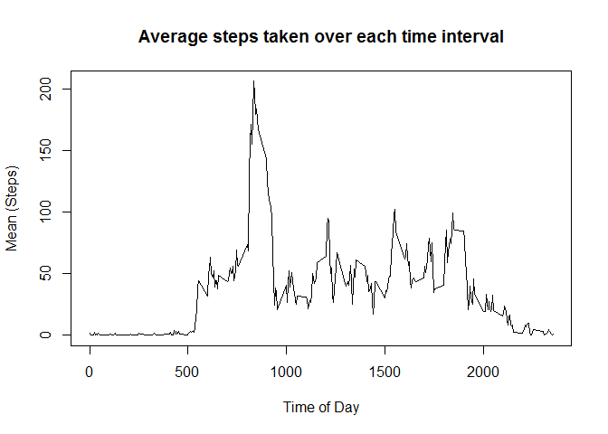
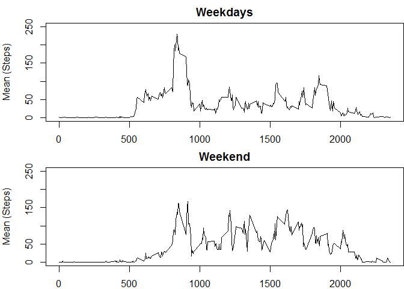

# Reproducible Research: Peer Assessment 1


## Loading and preprocessing the data

### 1) Read in the data, ignoring NA's.

```r
# Read data into a storage variable
setwd("D:/Coursera R/data")
step_data_NA<-read.csv("activity.csv")

# Remove lines with "NA" for the number of steps.
step_data<-step_data_NA[!is.na(step_data_NA$steps),]
```

## What is mean total number of steps taken per day?

### 1) Make a histogram of Steps Taken per day

```r
# Calculate steps taken per day
steps_per_day<-tapply(step_data$steps,step_data$date,FUN = sum)

#Remove days with NA's (due to factors being inherited from step_data)
steps_per_day<-steps_per_day[!is.na(steps_per_day)]

#Plot the data
hist(steps_per_day,xlab="Steps per Day",main="Histogram of Steps per Day")
```

<!-- -->

### 2) Calculate the Mean and Median steps taken per day

```r
# Calculate Mean
mean(steps_per_day)
```

```
## [1] 10766.19
```

```r
# Calculate Median
median(steps_per_day)
```

```
## [1] 10765
```

## What is the average daily activity pattern?

### 1) Calculate the average number of steps taken in each time interval and plot it.  The time of day is in Military time.  That is, 500 stands for 5AM, 1500 stands for 3PM, etc...


```r
# Calculate the mean of steps per time interval
steps_per_int<-tapply(step_data$steps,step_data$interval,FUN = mean)

# Plot the mean of steps per time interval

plot(step_data$interval[1:288], steps_per_int, type = "l",xlab="Time of Day",ylab="Mean (Steps)", main = "Average steps taken over each time interval")
```

<!-- -->

### 2) Find the time interval with the highest average.


```r
max(steps_per_int)
```

```
## [1] 206.1698
```

```r
which.max(steps_per_int)
```

```
## 835 
## 104
```

```r
steps_per_int[104]
```

```
##      835 
## 206.1698
```

We see that interval "835" (the 104'th entry) contains the maximum average value of 206.1698

## Imputing missing values

### 1) Calculate and report the total number of missing values in the dataset (i.e. the total number of rows with NAs)


```r
# Go back to original data to count "NA" values.
table(is.na(step_data_NA$steps))[2]
```

```
## TRUE 
## 2304
```

Here we see that there are 2304 "NA" values in the data set.

### 2) Devise a strategy for filling in all of the missing values in the dataset.


```r
table(step_data$date)
```

```
## 
## 2012-10-01 2012-10-02 2012-10-03 2012-10-04 2012-10-05 2012-10-06 
##          0        288        288        288        288        288 
## 2012-10-07 2012-10-08 2012-10-09 2012-10-10 2012-10-11 2012-10-12 
##        288          0        288        288        288        288 
## 2012-10-13 2012-10-14 2012-10-15 2012-10-16 2012-10-17 2012-10-18 
##        288        288        288        288        288        288 
## 2012-10-19 2012-10-20 2012-10-21 2012-10-22 2012-10-23 2012-10-24 
##        288        288        288        288        288        288 
## 2012-10-25 2012-10-26 2012-10-27 2012-10-28 2012-10-29 2012-10-30 
##        288        288        288        288        288        288 
## 2012-10-31 2012-11-01 2012-11-02 2012-11-03 2012-11-04 2012-11-05 
##        288          0        288        288          0        288 
## 2012-11-06 2012-11-07 2012-11-08 2012-11-09 2012-11-10 2012-11-11 
##        288        288        288          0          0        288 
## 2012-11-12 2012-11-13 2012-11-14 2012-11-15 2012-11-16 2012-11-17 
##        288        288          0        288        288        288 
## 2012-11-18 2012-11-19 2012-11-20 2012-11-21 2012-11-22 2012-11-23 
##        288        288        288        288        288        288 
## 2012-11-24 2012-11-25 2012-11-26 2012-11-27 2012-11-28 2012-11-29 
##        288        288        288        288        288        288 
## 2012-11-30 
##          0
```
A closer look reveals that every day that contains "NA" values, contains only "NA" values.  So, I've chosen to replace the NA's with the average number of steps during that interval from days where there are no NA's.

### 3) Create a new dataset that is equal to the original dataset but with the missing data filled in.


```r
# Replace NA's in "steps" with the mean of that interval
## initialize step_data_IM to accept new imputed data.
step_data_IM<-step_data_NA

## Impute the estimated data from steps_per_int into step_data_IM
### Since indexes go from 1:288, not 0:287, we have to make a special exception to make
### i%%288 =0 become 288 instead.
for(i in 1:length(step_data_NA$steps)){
     if (is.na(step_data_NA$steps[i])){
          step_data_IM$steps[i]<-steps_per_int[if(i%%288==0){288}else{i%%288}]
     }
}
```

### 4a) Make a histogram of the total number of steps taken each day and Calculate and report the mean and median total number of steps taken per day.


```r
# Calculate steps taken per day
steps_per_day_IM<-tapply(step_data_IM$steps,step_data_IM$date,FUN = sum)


#Plot the data
hist(steps_per_day_IM,xlab="Steps per Day",main="Histogram of Steps per Day")
```

<!-- -->

```r
# Calculate Mean
mean(steps_per_day_IM)
```

```
## [1] 10766.19
```

```r
# Calculate Median
median(steps_per_day_IM)
```

```
## [1] 10766.19
```

### 4b) Do these values differ from the estimates from the first part of the assignment?

The mean is the same, and the median is now the same as the mean, which is a minor difference.

### 4c) What is the impact of imputing missing data on the estimates of the total daily number of steps?

The only real difference is that there are now several more instances of days in the 10,000 to 15,000 range on the histogram since several "Average" days were imputed into the data set.  The estimates for overall mean and median are basically unchanged.

## Are there differences in activity patterns between weekdays and weekends?

### 1) Create a new factor variable in the dataset with two levels - "weekday" and "weekend" indicating whether a given date is a weekday or weekend day.


```r
## Load dplyr for use.
library(dplyr)
```

```
## Warning: package 'dplyr' was built under R version 3.2.5
```

```
## 
## Attaching package: 'dplyr'
```

```
## The following objects are masked from 'package:stats':
## 
##     filter, lag
```

```
## The following objects are masked from 'package:base':
## 
##     intersect, setdiff, setequal, union
```

```r
# Create some date strings for converting the 7 days into 2 factors
MtoF<-c("Monday","Tuesday","Wednesday","Thursday","Friday")
satsun<-c("Saturday","Sunday")

# Add Day of the week as a character vector
step_data_IM<-mutate(step_data_IM,dayofweek=weekdays(as.Date(step_data_IM$date)))

# Add a factor variable with 7 levels based on the 7 days of the week.
step_data_IM$dayType<-factor(step_data_IM$dayofweek)

# Transform the factor variable into 2 levels (weekday and weekend)
levels(step_data_IM$dayType)<-list(weekday = MtoF,weekend = satsun)

# Identify weekday and weekend rows.
isweekday<-step_data_IM$dayType=="weekday"
isweekend<-step_data_IM$dayType=="weekend"

# Make a new DF for each subset.
step_data_MF<-step_data_IM[isweekday,]
step_data_WE<-step_data_IM[isweekend,]

# Calculate average steps per interval for each subset individually
steps_per_int_MF<-tapply(step_data_MF$steps,step_data_MF$interval,FUN = mean)
steps_per_int_WE<-tapply(step_data_WE$steps,step_data_WE$interval,FUN = mean)
```

### 2) Make a panel plot containing a time series plot (i.e. type = "l") of the 5-minute interval (x-axis) and the average number of steps taken, averaged across all weekday days or weekend days (y-axis).


```r
# Initialize Plot window
par(mar=c(2,4,2,.02))
par(mfrow=c(2,1))

# Plot the mean of steps per time interval for weekdays
plot(step_data$interval[1:288], steps_per_int_MF, type = "l",ylab="Mean (Steps)",main = "Weekdays",ylim=c(0,250))

# Plot the mean of steps per time interval
plot(step_data$interval[1:288], steps_per_int_WE, type = "l",ylab="Mean (Steps)", main="Weekend",ylim = c(0,250))
```

<!-- -->
